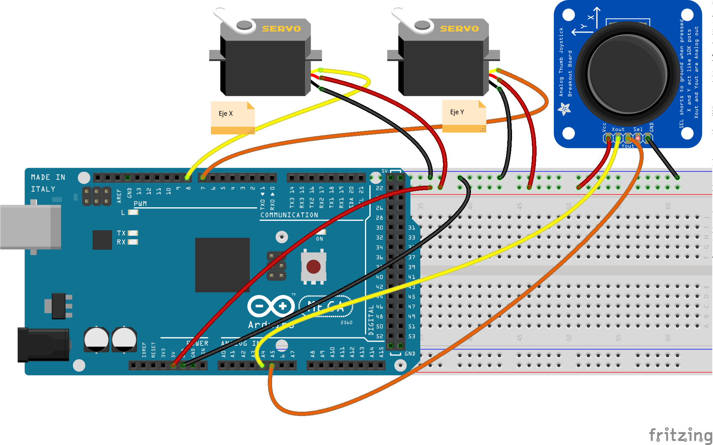

# Robótica Secundaria

Trabajos sobre robótica para secundaria

Compatidos con licencia CC

# Torreta controlada con un Joystick

Vamos a controlar una torreta de 2 servos con un joystick 

Usa como base la famosa [torreta de "ElTitoManolo" ](https://www.thingiverse.com/thing:2467743))

[Ejemplo de proyecto con ArduinoBlocks](http://www.arduinoblocks.com/web/project/173260)

### Montaje

### [Programación con bloques](http://www.arduinoblocks.com/web/project/173260)

### [Código](./codigo/arduinoblocks_173260.ino)

        #include <Servo.h>

        double AnguloX;
        double AnguloY;

        Servo servo_8;

        Servo servo_7;

        void setup(){
            pinMode(A4, INPUT);
            pinMode(A5, INPUT);

            servo_8.attach(8);
            servo_7.attach(7);
        }

        void loop(){

            AnguloX = map(analogRead(A4), 0,1023,0,180);
            AnguloY = map(analogRead(A5), 0,1023,0,180);
            
            servo_8.write(AnguloX);
            delay(100);
            
            servo_7.write(AnguloY);
            delay(100);

        }

