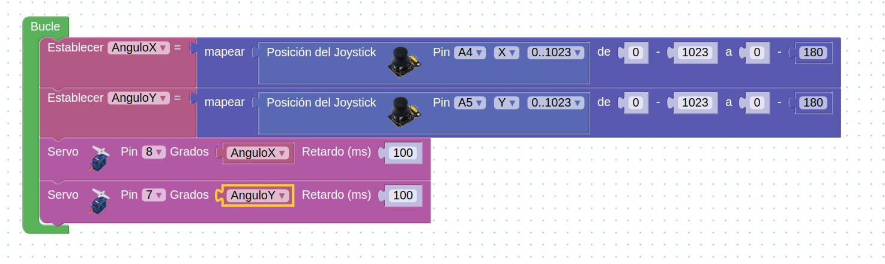

# Robótica Secundaria

Vamos a controlar una torreta de 2 servos con un joystick 

[Ejemplo de proyecto con ArduinoBlocks](http://www.arduinoblocks.com/web/project/173260)

### Montaje
Servo-joystick_esquemático.png

### [Programación con bloques](http://www.arduinoblocks.com/web/project/173260)

### [Código](./codigo/arduinoblocks_173260.ino)

